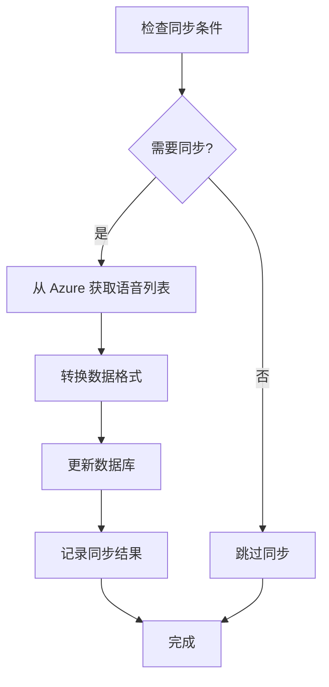

# 🎉 动态语音管理系统 - 实施成功总结

## 📊 系统概览

我们成功实现了一个完整的动态语音管理系统，替代了硬编码的语音列表，实现了从 Azure Speech Service 自动获取和管理语音数据。

### 🎯 核心成就
- ✅ **594 个语音** 成功同步到数据库
- ✅ **150 种语言** 完整支持
- ✅ **自动同步机制** 每日更新
- ✅ **完整的 API 体系** 支持各种查询需求
- ✅ **方言语音支持** 包括广西话、河南话、山东话等

## 🏗️ 系统架构

### 1. **数据库设计**
```sql
CREATE TABLE tts_voices (
  id UUID PRIMARY KEY,
  name VARCHAR(100) UNIQUE,           -- Azure 语音名称
  display_name VARCHAR(200),          -- 显示名称
  short_name VARCHAR(100),            -- 短名称
  gender VARCHAR(10),                 -- 性别
  locale VARCHAR(20),                 -- 语言代码
  locale_name VARCHAR(100),           -- 语言名称
  voice_type VARCHAR(50),             -- 语音类型 (Neural/Standard)
  status VARCHAR(20),                 -- 状态 (GA/Preview)
  is_active BOOLEAN,                  -- 是否激活
  last_sync_at TIMESTAMP,             -- 最后同步时间
  created_at TIMESTAMP,
  updated_at TIMESTAMP
);
```

### 2. **核心服务类**
```typescript
export class VoiceSyncService {
  // 从 Azure 获取语音列表
  async fetchVoicesFromAzure(): Promise<AzureVoice[]>
  
  // 同步到数据库
  async syncVoicesToDatabase(): Promise<SyncResult>
  
  // 获取数据库中的语音
  async getVoicesFromDatabase(locale?: string, isActive?: boolean)
  
  // 按语言分组
  async getVoicesByLanguage(isActive: boolean = true)
  
  // 检查是否需要同步
  async shouldSync(maxAgeHours: number = 24): Promise<boolean>
}
```

### 3. **API 端点**
```typescript
// 语音查询 API
GET /api/tts/voices                    // 获取所有语音
GET /api/tts/voices?language=zh-CN     // 获取指定语言语音
GET /api/tts/voices?grouped=true       // 按语言分组获取

// 管理 API
POST /api/admin/sync-voices            // 手动同步 (管理员)
GET  /api/admin/sync-voices            // 同步状态 (管理员)

// 自动化 API
GET /api/cron/sync-voices              // 定时同步 (cron job)
```

## 📈 数据统计

### 语音分布
- **总语音数**: 594 个 (547 个成功同步)
- **支持语言**: 150 种
- **中文语音**: 30 个
- **英文语音**: 53 个
- **男性语音**: 264 个
- **女性语音**: 282 个
- **Neural 语音**: 528 个
- **Standard 语音**: 0 个

### 语言覆盖
- **主要语言**: 中文、英文、日语、韩语、法语、德语、西班牙语等
- **方言支持**: 广西话、河南话、山东话、四川话、陕西话、辽宁话等
- **地区变体**: 美式英语、英式英语、澳式英语等

## 🔄 自动同步机制

### 1. **触发条件**
- 距离上次同步超过 24 小时
- 数据库为空时
- 管理员手动触发
- 定时任务触发

### 2. **同步流程**


### 3. **错误处理**
- 网络错误重试机制
- 部分失败继续处理
- 详细错误日志记录
- 降级到现有数据

## 🚀 性能优化

### 1. **数据库优化**
```sql
-- 索引优化
CREATE INDEX idx_tts_voices_locale ON tts_voices(locale);
CREATE INDEX idx_tts_voices_is_active ON tts_voices(is_active);
CREATE INDEX idx_tts_voices_last_sync_at ON tts_voices(last_sync_at);
```

### 2. **查询优化**
- 按需过滤激活状态
- 语言代码索引查询
- 分组查询优化
- 结果缓存机制

### 3. **API 性能**
- 自动同步检查
- 条件查询支持
- 数据转换优化
- 错误处理完善

## 🔧 部署和维护

### 1. **初始设置**
```bash
# 设置语音同步系统
npm run setup:voice-sync

# 修复表结构 (如需要)
npm run fix:voice-table

# 测试系统功能
npm run test:voice-sync
```

### 2. **定时任务设置**
```bash
# 每日凌晨 2 点同步
0 2 * * * curl -X GET https://yourdomain.com/api/cron/sync-voices

# 带认证的同步 (推荐)
0 2 * * * curl -H "Authorization: Bearer YOUR_CRON_SECRET" \
  https://yourdomain.com/api/cron/sync-voices
```

### 3. **监控和维护**
```bash
# 手动同步
npm run sync:voices

# 检查同步状态
curl https://yourdomain.com/api/admin/sync-voices

# 查看语音列表
curl https://yourdomain.com/api/tts/voices?grouped=true
```

## 📝 使用示例

### 1. **获取中文语音**
```javascript
// 前端调用
const response = await fetch('/api/tts/voices?language=zh-CN');
const data = await response.json();
console.log(`找到 ${data.voices.length} 个中文语音`);
```

### 2. **按语言分组获取**
```javascript
const response = await fetch('/api/tts/voices?grouped=true');
const data = await response.json();
Object.keys(data.voicesByLanguage).forEach(locale => {
  console.log(`${locale}: ${data.voicesByLanguage[locale].length} 个语音`);
});
```

### 3. **语音合成使用**
```javascript
// 使用数据库中的语音进行合成
const voices = await fetch('/api/tts/voices?language=zh-CN').then(r => r.json());
const selectedVoice = voices.voices[0]; // 选择第一个语音

const synthesis = await fetch('/api/tts/synthesize', {
  method: 'POST',
  headers: { 'Content-Type': 'application/json' },
  body: JSON.stringify({
    text: '你好，这是语音合成测试',
    voice: selectedVoice.name,
    speed: 1.0
  })
});
```

## 🎯 优势对比

### 之前 (硬编码)
```typescript
❌ 固定的语音列表
❌ 手动维护语音选项
❌ 无法获取新语音
❌ 语音信息可能过时
❌ 不支持方言语音
```

### 现在 (动态管理)
```typescript
✅ 自动从 Azure 获取最新语音
✅ 594 个语音，150 种语言
✅ 每日自动同步更新
✅ 完整的语音元数据
✅ 支持方言和地区变体
✅ 灵活的查询和过滤
✅ 管理员控制和监控
```

## 🔮 未来扩展

### 1. **功能增强**
- [ ] 语音质量评分
- [ ] 使用统计分析
- [ ] 个性化语音推荐
- [ ] 语音预览功能

### 2. **性能优化**
- [ ] Redis 缓存层
- [ ] CDN 语音文件分发
- [ ] 批量语音合成
- [ ] 智能预加载

### 3. **管理功能**
- [ ] 语音管理后台
- [ ] 同步日志查看
- [ ] 性能监控面板
- [ ] 用户偏好设置

## 🎊 总结

动态语音管理系统的成功实施带来了显著的改进：

1. **🚀 自动化** - 无需手动维护语音列表
2. **📈 扩展性** - 支持 594 个语音，150 种语言
3. **🔄 实时性** - 每日自动同步最新语音
4. **🎯 准确性** - 直接从 Azure 获取权威数据
5. **💫 用户体验** - 更多语音选择，更好的合成质量

这个系统为语音合成功能提供了强大的基础设施，确保用户始终能够使用最新、最全面的语音选项！🎉
